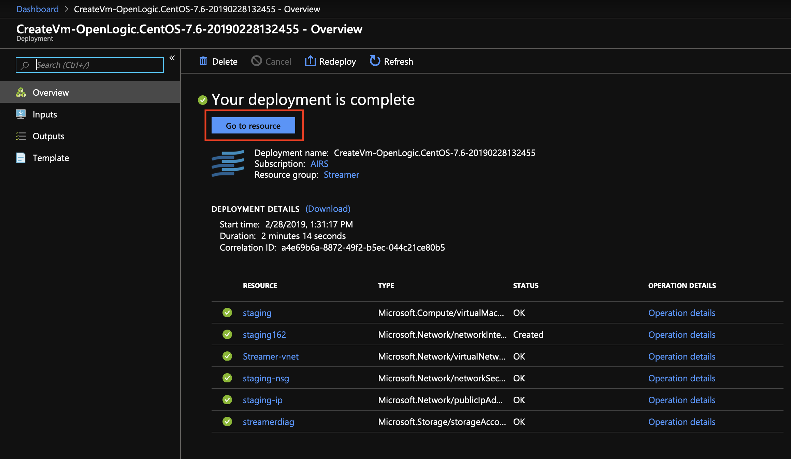
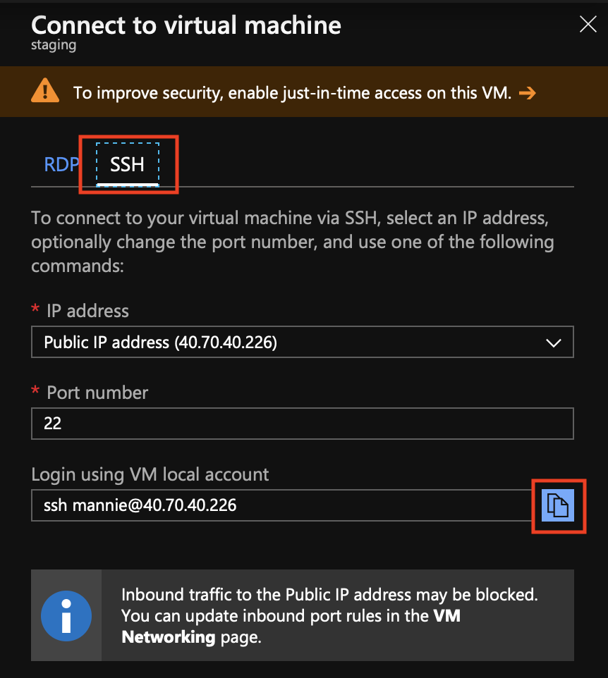

# Deploying The Streaming App Into Azure
Return to [Overview](ReadMe.md).


---


In this step, we will deploy the streamer app into Azure to run in Container Instances. In order to do so, we will need to make sure we have a an active Git client and Docker installation that we can use. The instructions below assume that you don't have either installed; if you already have these tools installed and prefer to use the local versions, feel free to do so.

We will also require access to command line interface (CLI) that is capable of [SSH tunneling](https://www.ssh.com/ssh/tunneling/). If your local CLI cannot SSH, feel free to use the [Azure Cloud Shell](https://shell.azure.com); follow these [instructions to set up your environment](CloudShell.md) if this is your first time using it.

Sections
1. [Creating the Staging VM](#creating-the-staging-vm)
1. [Configuring the VM](#configuring-the-vm)
1. [Deploying the Streamer App](#deploying-the-streamer-app)


---


## Creating the Staging VM
*If you already have an active Docker and Git installation, feel free to [skip this section](#deploying-the-streamer-app).*

1. Using the [Azure Portal](https://portal.azure.com), create the Virtual Machine that will act as our working environment as we deploy the streamer app. Click on `Create a resource`. In the search box that appears, search for `centos` and select `CentOS 7.6`.
  

1. You should be presented with a panel describing the service you're going to create; click `Create`.
  

1. Complete the form with information about the VM you want to create, ensuring that you create a new resource group for your VM. Give your VM a name and select a region close to your current location (or another preferred location). Set the authentication type to `password` and provide a valid username-password pair. You will also want to make sure that SSH is selected as a public inbound port. Once you have filled the form in, click `Review + create`.
  

1. You will be asked to review the configuration of your VM; click `Create`.
  

1. Once the VM has completed deploying, click `Go to resource`.
  

1. In order to log into the VM, will need to obtain its IP address. While on the overview section of the VM, click on `Connect`.
  

1. Select `SSH` from the panel that appears, and copy the login information (for later use) which should look something like `ssh mannie@123.45.67.89`.
  


---


## Configuring the VM
*If you already have an active Docker and Git installation, feel free to [skip this section](#deploying-the-streamer-app).*

1. SSH into your new VM via CLI using the login info provided at creation time:
  ```sh
  ssh $user@$hostip # example mannie@123.45.67.89
  ```
  You will receive a message (similar to this) asking you to confirm that you want to connect to the VM.
  ```
  The authenticity of host '40.84.44.109 (40.84.44.109)' can't be established.
  ECDSA key fingerprint is SHA256:4fYn6C2yelIAsds34GSDGTRgMrhT27Zcdfgytew45F3g.
  Are you sure you want to continue connecting (yes/no)?
  ```
  To confirm that you want to continue accessing the VM, type `yes` and hit `Enter`.

1. Once you've successfully logged in, the following commands to install Docker and its dependencies, as per the [Docker documentation](https://docs.docker.com/v17.09/engine/installation/linux/docker-ce/centos/#install-using-the-repository)). You will be prompted for your password and for confirmation; enter it and hit `Enter`.
  ```sh
  sudo yum install -y yum-utils device-mapper-persistent-data lvm2
  sudo yum-config-manager --add-repo https://download.docker.com/linux/centos/docker-ce.repo
  sudo yum install -y docker-ce
  ```
1. Start the Docker engine.
  ```sh
  sudo systemctl start docker
  ```
1. Verify that Docker installed correctly by running the `hello-world` image.
  ```sh
  sudo docker run hello-world
  ```
  You should see some output similar to the following (this confirms that Docker is correctly installed):
  ```
  Hello from Docker!
  This message shows that your installation appears to be working correctly.

  To generate this message, Docker took the following steps:
   1. The Docker client contacted the Docker daemon.
   2. The Docker daemon pulled the "hello-world" image from the Docker Hub.
      (amd64)
   3. The Docker daemon created a new container from that image which runs the
      executable that produces the output you are currently reading.
   4. The Docker daemon streamed that output to the Docker client, which sent it
      to your terminal.

  To try something more ambitious, you can run an Ubuntu container with:
   $ docker run -it ubuntu bash

  Share images, automate workflows, and more with a free Docker ID:
   https://hub.docker.com/

  For more examples and ideas, visit:
   https://docs.docker.com/get-started/
   ```

1. Install the Git SCM tool so that we can obtain a local copy of the streamer app later.
  ```sh
  sudo yum install -y git
  ```
  Use the following command to confirm the installation...
  ```sh
  which git
  ```
  ...which should yield the following result:
  ```
  /usr/bin/git
  ```  


---


## Deploying the Streamer App

1. Clone the [Event Streamer](https://github.com/mannie/EventStreamer) app and navigate into the project's root directory.
  ```sh
  git clone https://github.com/mannie/EventStreamer.git
  cd EventStreamer
  ```
1. Build the app and run it locally.
  ```sh
  sudo docker build --tag streamer .
  sudo docker run --interactive --tty --rm streamer
  ```
1. Create a Container Registry via the Azure Portal.
1. Deploy the container image into Azure.
  ```sh
  registry=address.to.registry # example manniesregistry.azurecr.io

  sudo docker login $registry
  sudo docker tag streamer $registry/streamer
  sudo docker push $registry/streamer
  ```


---


Move on to [Ingesting events into Event Hubs](EventHubs.md).
