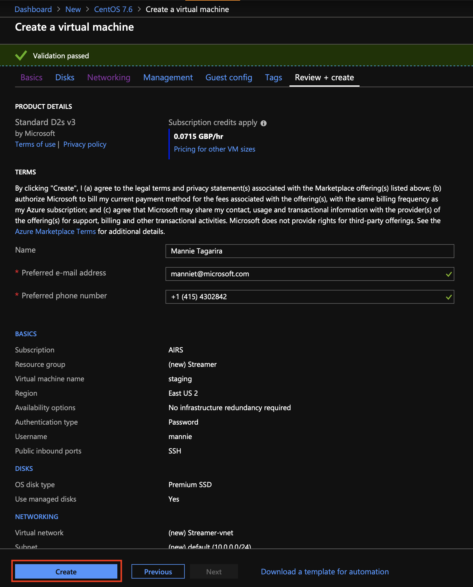

# Deploying The Streaming App Into Azure
Return to [Overview](ReadMe.md).

---


In this step, we will deploy the streamer app into Azure to run in Container Instances. In order to do so, we will need to make sure we have a an active Git client and Docker installation that we can use. The instructions below assume that you don't have either installed; if you already have these tools installed and prefer to use the local versions, feel free to do so.

We will also require access to command line interface (CLI) that is capable of [SSH tunneling](https://www.ssh.com/ssh/tunneling/). If your local CLI cannot SSH, feel free to use the [Azure Cloud Shell](https://shell.azure.com); follow these [instructions to set up your environment](CloudShell.md) if this is your first time using it.

---

## Creating the Staging VM
*If you already have an active Docker and Git installation, feel free to skip this section.*

1. Using the [Azure Portal](https://portal.azure.com), create the Virtual Machine that will act as our working environment as we deploy the streamer app:
  - Click on `Create a resource`.
  - In the search box that appears, search for `centos`.
  - Select `CentOS 7.6`.
  
  

1. You should be presented with a panel describing the service you're going to create; click `Create`.
  

1. Complete the form with information about the VM you want to create, ensuring that you:
  - create a new resource group for your VM;
  - give your VM a name;
  - select a region close you your current location (or another preferred location);
  - set the authentication type to `password`, providing a valid username and password;
  - select SSH as a public inbound port.

  Once you have filled the form in, click `Review + create`.

  

1. You will be asked to review the configuration of your VM; click `Create`.
  

1. Once the VM has completed deploying, click `Go to resource`.
  

1. In order to log into the VM, will need to obtain its IP address. While on the overview section of the VM, click on `Connect`.
  

1. Select `SSH` from the panel that appears, and copy the login information (for later use) which should look something like:
  ```sh
  ssh mannie@123.45.67.89
  ```
  


---


## Configuring the VM
*If you already have an active Docker and Git installation, feel free to skip this section.*

1. Remote login to your new VM via CLI using the login info provided at creation time:
  ```sh
  ssh $user@$hostip # example mannie@123.45.67.89
  ```
1. Once we've logged in, the following commands to install Brew:
  ```sh
  sh -c "$(curl -fsSL https://raw.githubusercontent.com/Linuxbrew/install/master/install.sh)"
  echo "export PATH=/home/linuxbrew/.linuxbrew/bin:$PATH" >> .bash_profile
  source .bash_profile
  ```

1. Install Git.
  ```sh
  brew install git
  ```
1. Install Docker and its dependencies, as per the [Docker documentation](https://docs.docker.com/v17.09/engine/installation/linux/docker-ce/centos/#install-using-the-repository)).
  ```sh
  sudo yum install -y yum-utils device-mapper-persistent-data lvm2
  sudo yum-config-manager --add-repo https://download.docker.com/linux/centos/docker-ce.repo
  sudo yum install -y docker-ce
  ```
1. Start the Docker engine.
  ```sh
  sudo systemctl start docker
  ```
1. Verify that Docker installed correctly by running the `hello-world` image.
  ```sh
  sudo docker run hello-world
  ```


---


## Deploying the Streamer App

1. Clone the [Event Streamer](https://github.com/mannie/EventStreamer) app and navigate into the project's root directory.
  ```sh
  git clone https://github.com/mannie/EventStreamer.git
  cd EventStreamer
  ```
1. Build the app and run it locally.
  ```sh
  sudo docker build --tag streamer .
  sudo docker run --interactive --tty --rm streamer
  ```
1. Create a Container Registry via the Azure Portal.
1. Deploy the container image into Azure.
  ```sh
  registry=address.to.registry # example manniesregistry.azurecr.io

  sudo docker login $registry
  sudo docker tag streamer $registry/streamer
  sudo docker push $registry/streamer
  ```


---
Move on to [Ingesting events into Event Hubs](EventHubs.md).
